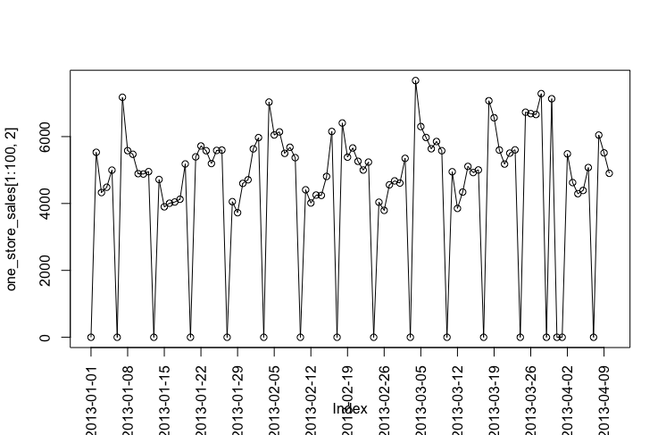

# Machine Learning Engineer Nanodegree
## Capstone Proposal
Jiang Ming 
March 21st, 2018

## Proposal
### Domain Background（项目背景）
​	本项目是要帮助Rossmann连锁药妆店的经理预测店铺未来的销售额，然而由于销售额会受到很多因素的影响，比如说折扣，节假日，季节，地理位置等因素。不同环境下的预测，其准确性会有所不同。因此，本项目选择坐落在德国的1115家店铺来预测其未来6个星期每天的销售额。准确的预测店铺未来一段时间的销售额，能够帮助经理更加合理的安排员工的工作时间，同时也有利于提升员工的工作效率。

​	最近几年比较火的XGBoost方法屡次在各大数据比赛中获得第一[^1]，XGBoost方法是由传统的GBDT方法发展而来，而GBDT的基学习器是CART，也就是基本的决策树模型。该项目来自于kaggle，这个比赛的第一名使用的算法也是xgboost[^2]。因此，在本项目中，也准备尝试使用xgboost来解决这个项目的问题。之所以选择这个项目，是因为未来也想开始参加一些kaggle的比赛，这是一个好的开始。

### Problem Statement（问题描述）
​	本项目的数据集来自真实世界中Rossmann连锁药妆店的销售数据和店铺数据，目标是要预测1115家店铺未来6周的销售额，这是一个标准的监督学习问题，同时也是一个时间序列的回归问题。

​	本项目一个很大的挑战在于，我们需要从现有的数据集中探索出店铺销售额的影响因素，从而才能预测店铺的销售额。另一个挑战在于，其预测周期为6周，较长的预测周期很有可能会给预测带来较大的误差，怎么才能找到影响店铺长期销售额的因素也很重要。总之，大量的特征工程和数据分析需要花费较多的时间。寻找影响店铺销售额的影响因素需要从现有数据集的字段出发，比如说，可以从store.csv数据集获取更多店铺的信息，店铺的分类水平(Assortment)，促销活动(Promo)以及竞争对手店铺的距离(ComprtitionDistance)等都是影响销售额的影响因素。Gert也给出了一些建议，比如区分三种类型的特征：使用近期的数据构造特征；考虑时间信息；近期趋势。	

### Datasets and Inputs（输入数据）
​	本项目的数据集由kaggle提供，使用的数据集主要由两个文件组成。一个是train.csv，是店铺的销售数据，主要字段比如销售额（Sales），客流量（Customers），日期（Date），促销信息（promo）等。另一个是store.csv，主要是1115家店铺的相关信息，主要字段有店铺类型（StoreType），竞争对手（Competitor），定期促销信息（Promotp2），摆放水平（Assortment）等。

​	通过观察数据发现，在store.csv文件中，i）有一些字段下的数据为空值，考虑使用0来填充； ii）对有些特征进行one-hot-vect处理，DayOfWeek，Assortment，StoreType，PromolInterval都是有限的类别，而且是字符型数据，所以要进行one-hot-vect处理，但是这么处理可能会使数据比较稀疏，特别是对PromolInterval中值的类别可能会比较多，但这是一种尝试；iii）考虑是否删掉销售额为0的数据，因为在评价时，当真实销售额为0时，是不带入计算的。训练时，考虑是否保留这些数据。

​	在train.csv文件中，选取店铺1从2013-01-01到2013-04-09的销售额数据，来观察其变化趋势。

 

​	从上图的销售额随时间变化的趋势可以看出来，i）每个月销售额会有相似的变化趋势，比如2013-01-08到2013-02-05的销售额和2013-02-05到2013-03-05的销售额，会呈现相似的波动趋势。因此，未来一个月的销售额，与前一个月有很强的相关关系，在构造特征时，需要注意这一点。ii）值得注意的是，销售额与DayOfWeek有很强的相关性，因为图中很明显的可以看出，周日是不营业的，销售额为0。iii）其余店铺均有同节结论，这里只展示了店铺1。通过分析发现特征与销售额之间存在的隐含关系，有利于构造更多的特征。	

### Solution Statement（解决办法）
​	本项目选择xgboost模型来解决该问题，xgboost是以CART作为基分类器的。CART能够解决回归问题，并且决策树算法能够给出每个特征的重要程度，有利于模型的特征筛选。同时，xgboost模型借鉴了随机森林的思想，支持列抽样，不仅能够防止过拟合，还能减少计算量。本项目的一个难点就在于特征的构造，然而可以利用xgboost的特点，来找出影响销售额的重要变量。

### Benchmark Model（基准模型）

​	在kaggle上，Gert在本项目上获得了第一名的成绩。以RMSPE为评价指标，其得分为0.10021。Gert[^2]使用的就是集成的xgboost 模型，也就是多个采用不同特征的xgboost模型集成。该比赛获得金奖的指标最低得分是0.11037，获得银奖的指标最低得分是0.11552，获得铜奖的最低得分是0.11773。由于能够参考很多前人的研究，特别是Gert给出了自己获得第一名的比赛文档，本项目设定的目标为RMSPE指标得分在0.11552以内。

### Evaluation Metrics（评估指标）
​	本项目的评价指标由kaggle给出， Root Mean Square Percentage Error (RMSPE)，而且有比赛的结果作为对比。因此，选择RMSPE作为评价指标，定义为：

$$RMSPE=\sqrt{\frac{1}{n}\sum_{i=1}^N(\frac{y_i-\hat{y_i}}{y_i})^2}$$ 

其中$y_i$表示真实的销售额，$\hat{y_i}$表示销售额的预测值。当销售额为0时，不带入计算。该指标的含义是预测值与真实值之间的误差占真实值比例的反映，RMSPE的值越小代表预测越准确。

### Project Design（设计大纲）
​	下面分别介绍项目的主要工作流程：

1. 数据分析
   - 读取train.csv和store.csv数据集，针对store.csv的数据中“数据输入”部分的处理，并且合并两个数据集，称为all_data。
   - 对数据集all_data进行分割，原则是validation data和test data分别保留6周的数据，因此按照时间划分后，从从2013-01-01到2015-05-08的数据作为train_data，从2015-05-09到2015-06-19的数据作为validation_data，从2015-06-20到2015-07-31的数据作为test_data。
   - 对train_data进行特征提取，现有的数据中，有很多字段（特征）是对销售额有重要的影响。比如，DayOfWeek，Customers，Promo，SchoolHoliday，Competitor，Promo2SinceWeek等。除了这些特征以外，根据Gert[^2]的建议，构造更多的特征。对于特征，Gert指出了三种类型的特征。第一种是Recent data，第二种是Terporal information，第三种是Current data，以及其他信息。对validation_data和test_data进行相同的处理。 
2. 模型训练和预测
   - 对于xgboost模型参数的设置，可以考虑从比较有名的公开脚本开始[^3]。
   - 使用train_data和validation_data训练XGBoost模型，并且使用交叉验证，得到模型在验证集上的预测结果。
   - 观察每个影响因素的重要程度。
3. 优化模型
   - 使用不同的特征训练xgboost模型，再进行模型融合，得到预测结果
   - 使用2013-05到2013-09和2014-05到2014-09以及2015-05到2015-06-19的数据作为训练数据，来训练xgboost模型。因为这些月份覆盖了测试集的时间区间，并且能够包含test data之前的一些销售信息。
   - 在test data上验证模型的预测效果。

### Reference

[^1]:  Chen T, Guestrin C. XGBoost: A Scalable Tree Boosting System[C]// ACM SIGKDD International Conference on Knowledge Discovery and Data Mining. ACM, 2016:785-794.  
[^2]:   [Gert's model doucmentation.](https://kaggle2.blob.core.windows.net/forum-message-attachments/102102/3454/Rossmann_nr1_doc.pdf)

[^3]:  <https://www.kaggle.com/abhilashawasthi/xgb-rossmann/code 

